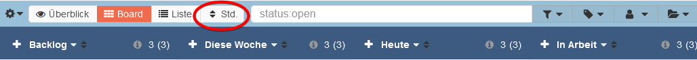
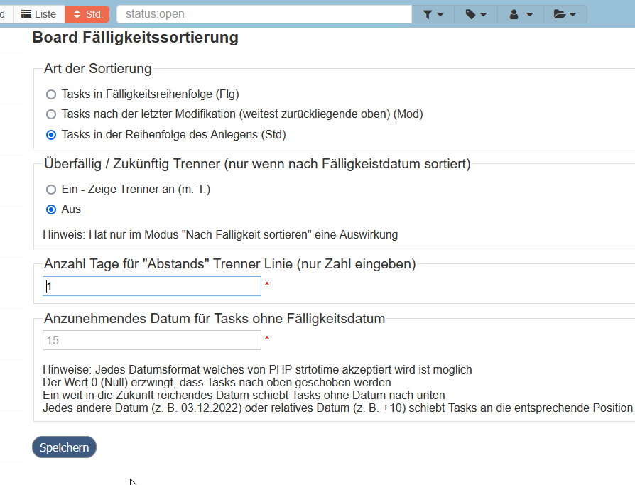

 Use the table of contents

  

**:star: If you use it, you should star it on GitHub!** *It's the least you can do for all the work put into it!*

# Due Date sorting for Kanboard

Allows to display all columns of a board by due dates, last modification date or as they were filed on the board. With three clicks.

## Advantages
- Easy switching between
  - Show all tasks in all columns by due date
  - Show all tasks in all columns by last modification of a task
  - Show all tasks in all columns in order of the arrangement (Kanboards default view)
- Enter date or time period (e.g. +10 days from today) to use fictitious due date, if a task has no due date set, to display these tasks accordingly
- Optionally show a separator between overdue tasks and tasks that are not yet overdue
- Display in the board header what kind of sorting is currently active
- Multilanguage Support (English and German at the moment, help wanted for more translations)

## Screenshots

### New button at the top of the page

This plugin adds a new button to the top of each page in the toolbar.  The button will show you whether the current sort is "due date" or "board order" (the default).  Clicking on the button will take you to the settings panel, where you can change the sorting.

**NOTE:**  This setting affects every board of the current user and is stored in your user preferences.

### Settings panel

The settings panel will allow you to change the sorting order.  The current sorting method will be initially selected by default.  

## Author

- JustFxDev (since v1.2.0)
- David Morlitz (until v1.1.0)
- License MIT

## Requirements
- Kanboard >= 1.0.40

## Installation
You have the choice between 3 methods:

1. Install the plugin from the Kanboard plugin manager in one click
2. Download the zip file and decompress everything under the directory `plugins/DueDate`
3. Clone this repository into the folder `plugins/DueDate`

Note: Plugin folder is case-sensitive.
